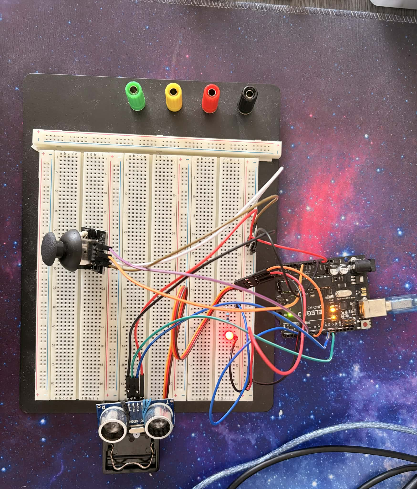
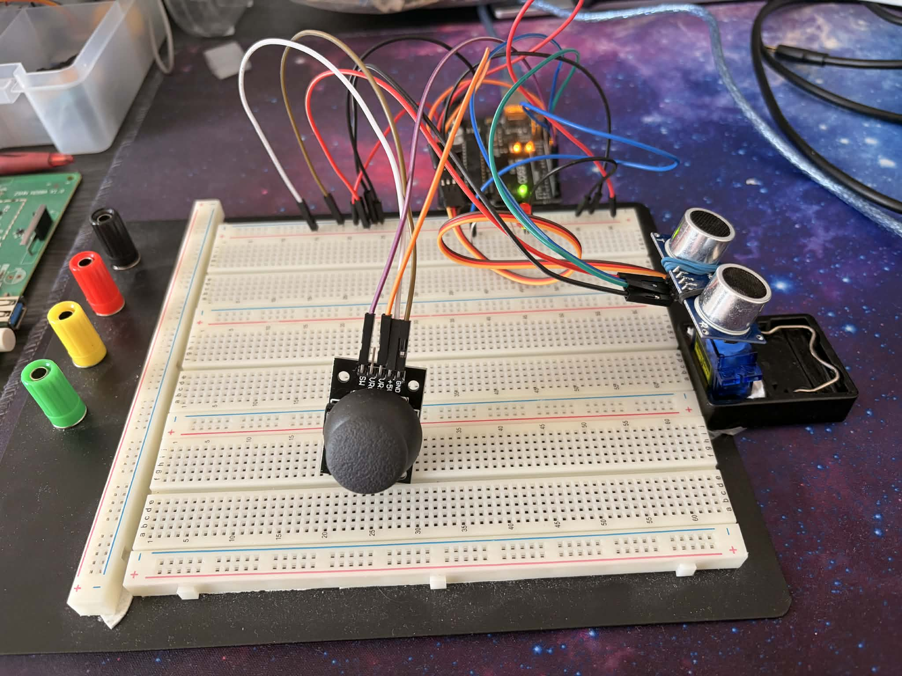
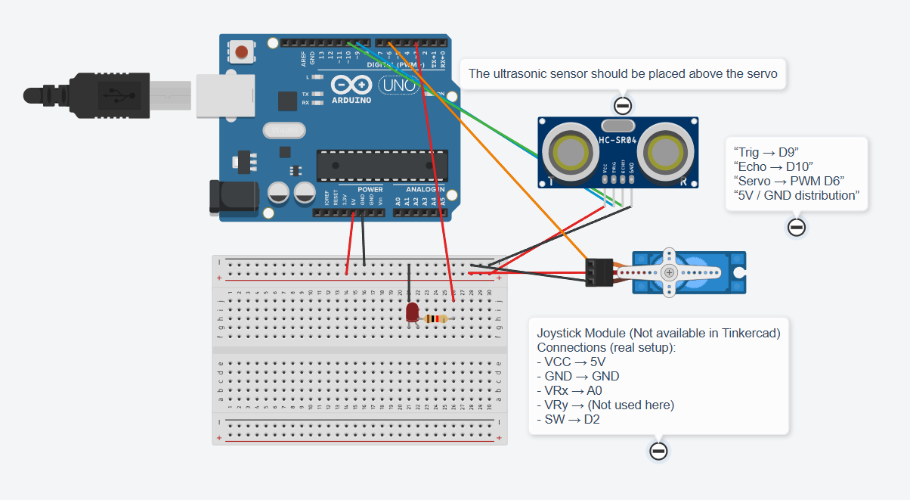
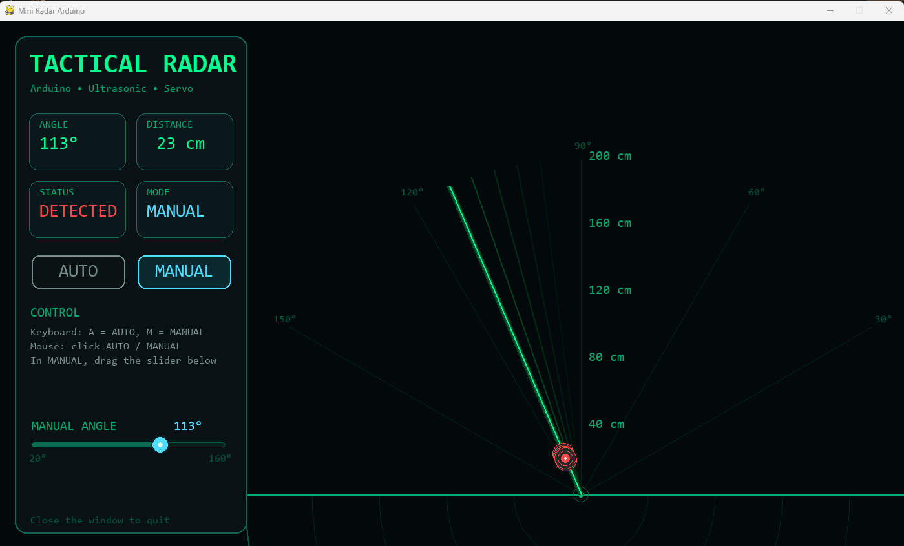

## Interface Overview

The Python application provides a real-time radar-style interface connected to the Arduino system.

The interface displays:
- Current servo angle
- Measured distance
- Detection status
- Current operating mode
- Radar sweep animation
- Persistent target markers

It also includes on-screen controls for switching modes and adjusting the servo angle manually.

---

## Controls

The system can be controlled directly from the Python interface.

### Mode Selection
You can switch between operating modes in two ways:
- Press `A` to activate AUTO mode
- Press `M` to activate MANUAL mode
- Click the `AUTO` or `MANUAL` buttons in the interface

### Manual Control
In MANUAL mode, the radar angle can be adjusted:
- By dragging the on-screen slider in the Python interface
- By using the physical joystick in the hardware setup

### Keyboard Shortcuts
- `A` = AUTO mode
- `M` = MANUAL mode
- Left arrow = decrease manual target angle
- Right arrow = increase manual target angle

---

## How the Modes Work

### AUTO Mode
In AUTO mode, the servo automatically sweeps between its minimum and maximum angles.
The radar interface updates continuously with the current angle and measured distance.

### MANUAL Mode
In MANUAL mode, the radar no longer sweeps automatically.
Instead, the angle can be controlled manually.

Two manual control methods are supported:
- Hardware joystick control
- Python interface control through the slider

The Python slider sends angle commands to the Arduino, allowing direct control from the desktop interface.

---

## Radar Visualization

The radar screen is designed to make the system easier to interpret visually.

Features include:
- A live sweep line showing the current angle
- Target markers based on measured distance
- Persistent detections that remain visible briefly after being scanned
- Status indicators for object detection and operating mode

This interface was developed using Pygame and communicates with the Arduino through serial communication.

## Media

### Hardware Setup

### Circuit Diagram

### Radar Interface

### Demo Video
[Watch the demo video](VIDEO_LINK_HERE)

## Developer Notes

The Python interface communicates with the Arduino through serial commands to:
- switch between AUTO and MANUAL modes
- set a manual target angle
- return control to the joystick when needed
